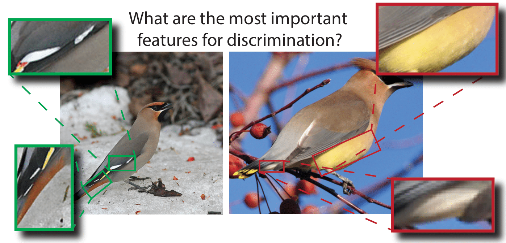

## Less is More: Discovering Concise Network Explanations (DCNE)

This code reproduces the results for the paper Less is More: Discovering Concise Network Explanations (DCNE) presented at the First Re-Align Workshop at ICLR 2024.
In the most recent version of the paper, we include data from a second annotator and 10 more species (for a total of 15 species).

Check out our [Project Page](https://www.vision.caltech.edu/dcne/).



### Environment
```
conda create -n "DCNE" python=3.10.10
conda activate DCNE
pip install -r requirements.txt
```

### Download checkpoints, annotations, and datasets
```
mkdir checkpoints
cd checkpoints
wget https://data.caltech.edu/records/d2yyy-tt507/files/resnet34_CUB_expert.pth.tar?download=1
cd ..

mkdir data
cd data
wget https://data.caltech.edu/records/65de6-vp158/files/CUB_200_2011.tgz?download=1
tar -xzvf CUB_200_2011.tgz
rm CUB_200_2011.tgz
wget https://data.caltech.edu/records/d2yyy-tt507/files/human_expert_feature_annotation.zip?download=1
unzip human_expert_feature_annotation.zip
rm human_expert_feature_annotation.zip
```

### Run minimal example
```
bash ./minimal_example.sh
```


### (Optional) Download pre-computed explanations from paper
```
wget https://data.caltech.edu/records/d2yyy-tt507/files/explanations.zip?download=1
```

### Bibtex
If you find our work or dataset useful in your research please consider citing our work.
```
@inproceedings{kondapaneni2024less,
  title={Less is More: Discovering Concise Network Explanations},
  author={Kondapaneni, Neehar and Marks, Markus and Mac Aodha, Oisin and Perona, Pietro},
  booktitle={ICLR 2024 Workshop on Representational Alignment},
  year={2024}
  doi={https://doi.org/10.48550/arXiv.2405.15243}
}
```
